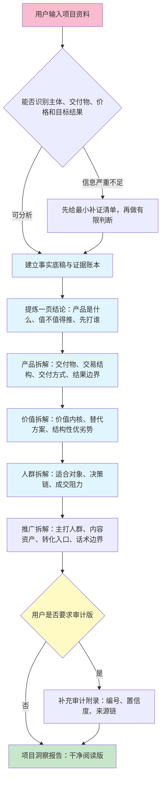

# 项目洞察助手PRO

## 兼容环境

适用于 Codex/Claude 类本地 skill 环境；联网证据采集需要可用搜索或网页读取工具；GitHub 分享版请把安装、发布和校验文档放在仓库根目录或 docs/。

## 任务定位

只做项目洞察第一阶段：把用户提供的项目资料转换成可读、可判断、可溯源、可复用的项目洞察报告。

PRO 版默认输出必须服务正常阅读，先回答：
- 这个产品到底是什么
- 用户付费后买到什么，怎么交付
- 它解决什么问题，价值在哪里
- 结果路径是什么，边界在哪里
- 适合谁，不适合谁
- 谁付款、谁使用、谁影响决策
- 成交阻力和反对理由是什么
- 日常推广先打哪群人
- 用哪些内容资产承接咨询和转化
- 推广时应该打什么卖点，避开什么红线

编号、置信度、证据账本默认只做内部底稿，不展示给用户。用户明确要求“审计版、证据版、编号版、置信度表、证据账本”时，才展开这些内容。

PRO 版输出还必须能直接交给：
- 选题框架流程
- 素材筛选流程
- 宣传写作流程
- 短视频脚本流程
- 咨询话术流程

PRO 版不继续生成选题框架，不筛选素材，不写文章成稿。

## Architecture



## 输入输出接口

### 输入

可接受：
- 招生简章、项目手册、课程页、官网介绍
- 用户口述、顾问笔记、内部资料
- 竞品资料、替代方案资料
- 截图文字、文章摘录、政策文件

资料不足时继续做有限分析，同时列出最小补充清单。

### 输出

默认正式产物：

```text
项目洞察报告
```

默认采用“干净阅读版”结构：

- 一页结论：产品是什么、核心价值、是否值得推广、优先人群、关键红线
- 产品拆解：主体、交付物、交易结构、交付方式、费用边界
- 结果路径：项目能支持到哪一步，最终结果依赖哪些条件，哪些话不能说满
- 分析结论：价值内核、结构性优劣势、替代方案压力
- 目标人群：适合人群、不适合人群、购买者、使用者、影响者、反对者
- 成交阻力：真实反对理由、回应方向、需要补充的证据
- 推广打法：先打哪群人、打什么痛点、卖点顺序、内容角度、转化入口、话术边界
- 内容资产：日常可生产的内容方向、适合平台、承接方式、销售使用方式
- 下游写作指令：给选题、素材、文章、短视频、咨询话术使用

默认输出中禁止出现：
- 编号列
- 置信度列
- 大段信息索引
- 审计附录
- 证据账本表

只有用户明确要求审计版时，才追加：
- 编号事实表
- 置信度说明
- 来源链
- 证据账本
- 信息索引

## 必读引用

执行前读取：
- `references/01-项目洞察PRO流程.md`
- `references/03-证据与推广红线规则.md`

用户要求审计版时再读取：
- `references/02-信息编号与置信度规则.md`

需要输出默认结构时读取：
- `templates/项目宣传写作输入包模板.md`

## 执行规则

- 默认输出必须是自然语言业务报告，不展示编号和置信度。
- 首屏必须回答八个问题：产品是什么、用户买到什么、核心价值是什么、结果边界在哪里、适合谁、先打哪群人、转化入口是什么、哪些话不能说。
- 连续表格最多两张；超过两张时，先用短段落解释结论，再放表格。
- 内部分析仍要保留来源、时效、推导依据和风险等级，但默认只用自然语言来源短注表达。
- 来源不足的信息，在正文中用“需补证”“暂不建议对外宣传”等自然语言处理。
- 发现推广红线时，必须给出替代表述。
- 如果用户资料不足，继续做有限分析，并列出缺口。
- 如果用户要求生成选题、筛素材或写成稿，提醒应切换到对应后续流程。
- 用户明确要求审计版时，按编号与置信度规则补充审计附录。

## 默认交付方式

分析结果优先在当前对话完整输出。用户明确要求保存或需要复用时，保存到用户指定目录；未指定目录时，选择当前环境允许写入的安全输出目录，并使用以下相对结构：

```text
项目洞察助手PRO输出/[项目名]-[日期]/
```

建议文件：
- `01-输入资料.md`
- `02-证据账本.md`
- `03-项目洞察报告.md`
- `04-缺口与下一步.md`

## 质量闸门

输出前检查：
- 开头是否直接说明“产品是什么、适合谁、怎么推”。
- 是否拆清楚交易与交付结构、结果路径、用户决策链、成交阻力和内容转化入口。
- 默认输出是否已经去掉编号、置信度和审计附录。
- 强卖点是否有可靠来源支撑。
- 结构性劣势是否被条件化处理。
- 是否存在保录取、保就业、收益保证等风险表达。
- 是否把待核验信息写成确定事实。

## GitHub 分享版维护规则

- 运行时文件只保留 `SKILL.md`、`references/`、`templates/` 和必要经验文件。
- 安装、校验、发布、协作说明放在仓库根目录或 `docs/`，不要放进 skill 运行目录。
- 示例输入输出放在仓库 `examples/`，避免增加 skill 运行时上下文负担。
- 打包产物放在 `dist/` 或 GitHub Releases，源文件以 `skill/项目洞察助手PRO/` 为准。
- 发布前运行仓库内 `scripts/validate.ps1`，确认无个人本机路径、无缺失引用、无 README 混入 skill 目录。

## 维护说明

- 第一阶段流程维护在 `references/01-项目洞察PRO流程.md`。
- 编号、置信度和来源链维护在 `references/02-信息编号与置信度规则.md`。
- 证据账本和推广红线维护在 `references/03-证据与推广红线规则.md`。
- 输出结构维护在 `templates/项目宣传写作输入包模板.md`。

